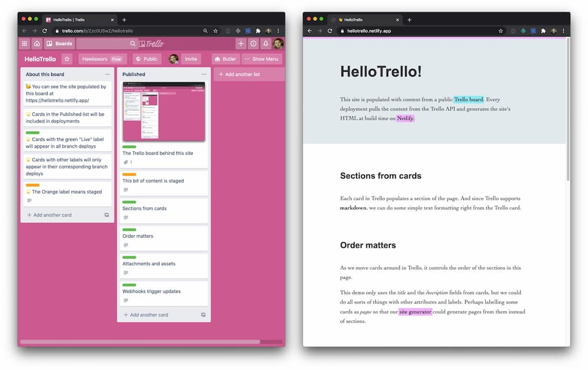

# Hello Trello

A little experiment to pull content from the Trello API and use it to populate content on a simple web site.

- Production: [https://hellotrello.netlify.app](https://hellotrello.netlify.app)
- Staging: [https://stage--hellotrello.netlify.app](https://hellotrello.netlify.app)

The site is populated from a list of cards in a public (but read only) [Trello board](https://trello.com/b/Zzc0USwZ/hellotrello)

Why? 👉 https://twitter.com/philhawksworth/status/1253696940170186754




## Sections from cards

Each card in Trello populates a section of the page. And since Trello supports markdown, we can also do some simple text formatting with the markdown we get from the cards API.

## Quick start

To clone this repo, create a new Netlify site and start making changes click the button below and follow the instructions.

[](https://app.netlify.com/start/deploy?repository=https://github.com/philhawksworth/hello-trello&utm_source=github&utm_medium=hellotrello-pnh&utm_campaign=devex)

## Webhooks trigger updates

Whenever we make changes in the Published list, Trello triggers a [Netlify build hook](https://docs.netlify.com/configure-builds/build-hooks/?utm_source=github&utm_medium=hellotrello-pnh&utm_campaign=devex) which initiates a new build and deployment, updating the site.

We can use the Trello API to create the webhook which will trigger a new build automatically when changes are made to the board.

1. Create a [new Build Hook](https://docs.netlify.com/configure-builds/build-hooks/?utm_source=github&utm_medium=hellotrello-pnh&utm_campaign=devex#app) in your Netlify site admin
2. Register your Build Hook as a webhook with Trello using the utility below.


```bash
# Register a webhook with Trello, to invoke a build whenever the board is updated
npm run hook --url https://api.netlify.com/build_hooks/XXXXX
```


Trello paid accounts can have buttons which can make HTTP Post requests, which means we cold have a button which initiates a site deployment on Netlify via a build hook instead of for every update on the board.


## Staging / Production

Netlify lets you create an unlimited number of environments [based on git branches](https://docs.netlify.com/site-deploys/overview/#branches-and-deploys?utm_source=github&utm_medium=hellotrello-pnh&utm_campaign=devex). Each gets its own URL. This example maps the labels on the Trello cards to the different branches, so we event get a simple publishing workflow.

